# SQL--DATA_WAREHOUSE_PROJECT
Designing a Scalable SQL Server Data Warehouse with End-to-End ETL, Data Modeling, and Analytics
# README

## Data Warehouse (SQL Server)

Welcome to the **Data Warehouse** repository.

This is an end-to-end data warehouse project that transforms raw **ERP + CRM** sales data (CSV files) into a clean, reliable, and **analysis-ready** model in **SQL Server**, following the **Medallion Architecture (Bronze → Silver → Gold)**.

---

### Table of Contents

- [Objective](#objective)
- [Specifications](#specifications)
- [Project Highlights](#project-highlights)
- [Data Architecture (Bronze / Silver / Gold)](#data-architecture-bronze--silver--gold)
- [Naming Conventions](#naming-conventions)
- [Bronze Layer](#bronze-layer)
- [Silver Layer](#silver-layer)
- [Gold Layer](#gold-layer)
- [Final Project Flow](#final-project-flow)

---

### **Objective**

Develop a modern data warehouse using SQL Server to consolidate sales data, enabling analytical reporting and informed decision-making.

---

#### **Specifications**

- **Data Sources**: Import data from two source systems (ERP and CRM) provided as CSV files.
- **Data Quality**: Cleanse and resolve data quality issues prior to analysis.
- **Integration**: Combine both sources into a single, user-friendly data model designed for analytical queries.
- **Scope**: Focus on the latest dataset only; historization of data is not required.
    
    The project only works with the **current/latest version of the data**. Previous versions or changes to records over time will **not be tracked or stored**.                                       ****
    
    #### Common historization approach: SCD (reference)
    
    Historization is commonly implemented using **Slowly Changing Dimensions (SCD)**:
    
    - **SCD Type 1:** Overwrite the old value → **no history**
    - **SCD Type 2:** Create a new record for each change → **full history**
    - **SCD Type 3:** Keep limited previous values → **partial history**
    
    > In this project, the approach aligns with **Type 1 (overwrite)** where applicable.
    > 
- **Documentation**: Provide clear documentation of the data model to support both business stakeholders and analytics teams.

---

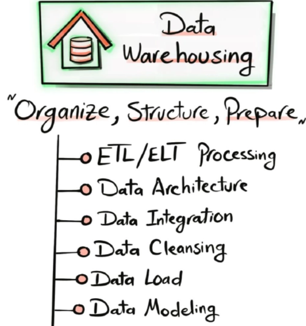

*High-level overview of the end-to-end data warehouse workflow.*

#### **Data Warehouse Concepts**

1. **ETL/ELT Processing:** Extracting, transforming, and loading data efficiently
2. **Data Architecture:** Designing a scalable and maintainable warehouse architecture
3. **Data Integration:** Combining data from multiple sources into a unified model
4. **Data Cleansing:** Handling missing, duplicate, inconsistent, and inaccurate data
5. **Data Loading:** Loading processed data into the warehouse efficiently
6. **Data Modeling:** Designing fact & dimension tables (star schema) 
7. **Data Modeling:** Designing fact and dimension tables to create a well-structured data    model

**TYPES OF ARCHITECTURE**

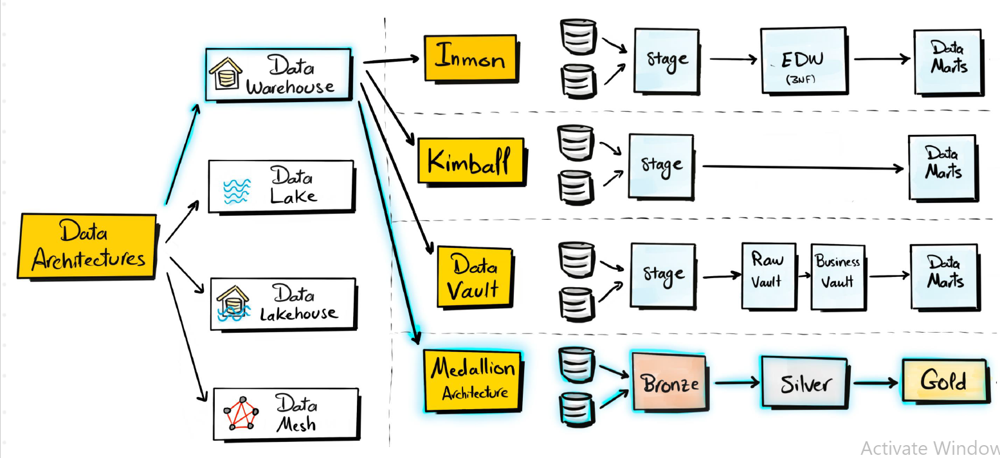

---

## Data Architecture: Medallion **Architecture**

The data architecture for this project follows,                                                                    Medallion Architecture **Bronze**, **Silver**, and **Gold** layers:

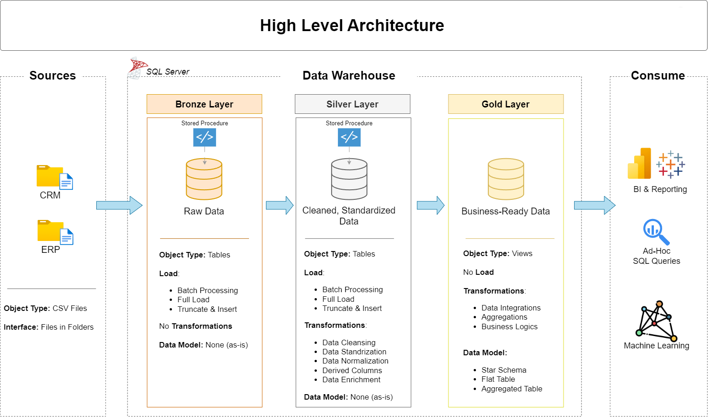

***Architecture diagram showing data movement across layers.***

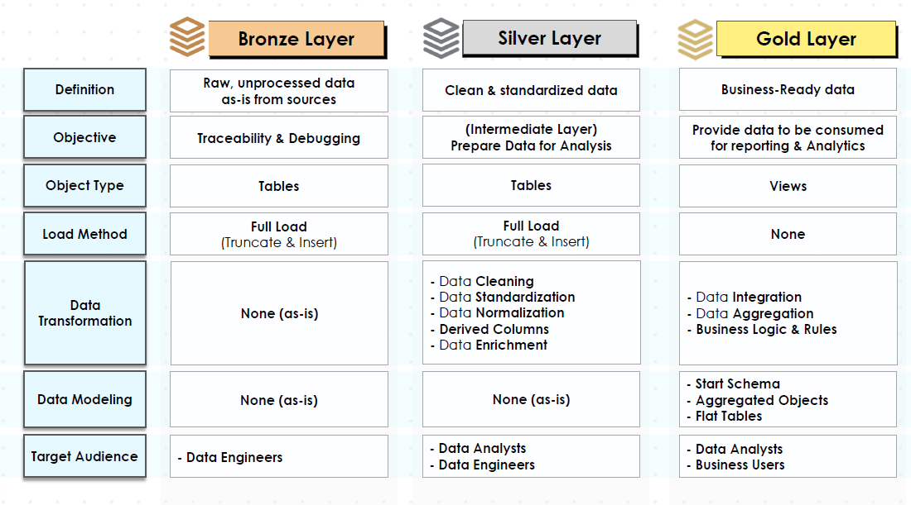

***Medallion layers: Bronze (raw) → Silver (clean) → Gold (business-ready).***

**Bronze Layer (RAW DATA)**                                                                                                    Stores raw data as-is from the source systems. Data is ingested from CSV Files into SQL Server Database.

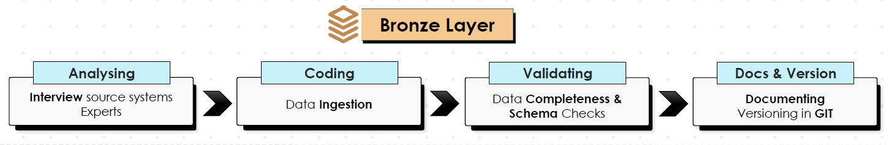

***Bronze layer: raw ingestion tables.***

**Silver Layer (Cleansed / Standardized)**                                                                                   This layer includes data cleansing, standardization, and normalization processes to prepare data for analysis.                                                                                                                           **#** **Coding and Validating** are in a **loop** till we get a nice satisfactory result.

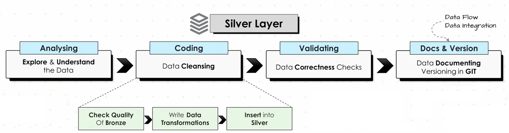

***Silver layer: iterative cleansing and validation.***

**Gold Layer (Business-ready / Star Schema)**                                                                           Houses business-ready data modeled into a star schema required for reporting and analytics.  **#** **Coding and Validating** are in a **loop** till we get a nice satisfactory result.

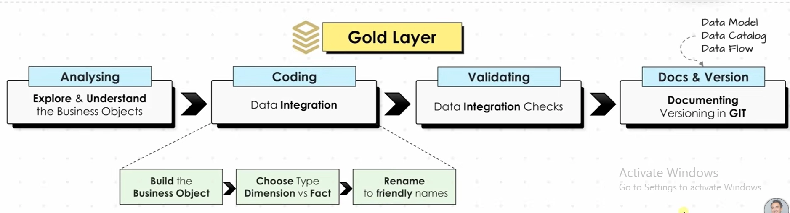

***Gold layer: star schema tables for analytics.***

---

## Naming Convention

This section outlines naming conventions for schemas, tables, columns, and stored procedures.

### **General Principles**

- **Naming Conventions**: Use **snake_case**, with lowercase letters and underscores (`_`) to separate words.
- **Language**: Use English for all names.
- **Avoid Reserved Words**: Do not use SQL reserved words as object names.

### **Table Naming Conventions**

#### **Bronze Rules**

- All names must start with the source system name, and table names must match their original names without renaming.
- **`<sourcesystem>_<entity>`**
    - `<sourcesystem>`: Name of the source system (e.g., `crm`, `erp`).
    - `<entity>`: Exact table name from the source system.
    - Example: `crm_customer_info` → Customer information from the CRM system.

#### **Silver Rules**

- Silver keeps the **same source-based naming** as Bronze (data is transformed/cleaned, but naming remains source-aligned)
- **`<sourcesystem>_<entity>`**
    - Example: `crm_customer_info` → Customer information from the CRM system.

#### **Gold Rules**

- All names must use meaningful, business-aligned names for tables, starting with the category prefix.
- **`<category>_<entity>`**
    - `<category>`: Describes the role of the table, such as `dim` (dimension) or `fact` (fact table).
    - `<entity>`: Descriptive name of the table, aligned with the business domain (e.g., `customers`, `products`, `sales`).
    - Examples:
        - `dim_customers` → Dimension table for customer data.
        - `fact_sales` → Fact table containing sales transactions.

#### **Glossary of Category Patterns**

| Pattern | Meaning | Example(s) |
| --- | --- | --- |
| `dim_` | Dimension table | `dim_customer`, `dim_product` |
| `fact_` | Fact table | `fact_sales` |
| `report_` | Report table | `report_customers`, `report_sales_monthly` |

### **Column Naming Conventions**

#### **Surrogate Keys**

- All primary keys in dimension tables must use the suffix `_key`.
- **`<table_name>_key`**
    - `<table_name>`: Refers to the name of the table or entity the key belongs to.
    - `_key`: A suffix indicating that this column is a surrogate key.
    - Example: `customer_key` → Surrogate key in the `dim_customers` table.

#### **Technical Columns**

- All technical columns must start with the prefix `dwh_`, followed by a descriptive name indicating the column’s purpose.
- **`dwh_<column_name>`**
    - `dwh`: Prefix exclusively for system-generated metadata.
    - `<column_name>`: Descriptive name indicating the column’s purpose.
    - Example: `dwh_load_date` → System-generated column used to store the date when the record was loaded.

#### **Stored Procedure**

- All stored procedures used for loading data must follow the naming pattern:
- **`load_<layer>`**.
    - `<layer>`: Represents the layer being loaded, such as `bronze`, `silver`, or `gold`.
    - Example:
        - `load_bronze` → Stored procedure for loading data into the Bronze layer.
        - `load_silver` → Stored procedure for loading data into the Silver layer.

---

## Bronze Layer

### Why do we need schemas?

Suppose you have one database:

```
DataWarehouse
```

Without schemas, you might have:

```
customers
customers_cleaned
customers_final
orders
orders_cleaned
orders_final
products
products_cleaned
products_final
...
```

As the project grows, it becomes difficult to understand:

- Which table is raw?
- Which table has been cleaned?
- Which table is used for reporting?
- Who should be allowed to modify which tables?
- Where should a new table belong?

Schemas solve this by creating **logical divisions**.

```
💡 DataWarehouse
├── bronze   -> raw data 
├── silver   -> cleaned/transformed data
└── gold     -> business-ready data
```

---

## Silver Layer

### ETL – Extract, Transform, Load

**ETL** is a data pipeline process used to move data from different sources into a target system such as a **data warehouse**.

- **Extract:** Collect data from sources like databases, files, APIs, web scraping, or streaming systems.
- **Transform:** Clean and prepare the data by removing duplicates, handling missing/invalid values, applying business rules, standardizing data, and creating derived columns.
- **Load:** Store the transformed data into the target system using methods such as **Full Load, Incremental Load, Append, Merge, or Upsert**.

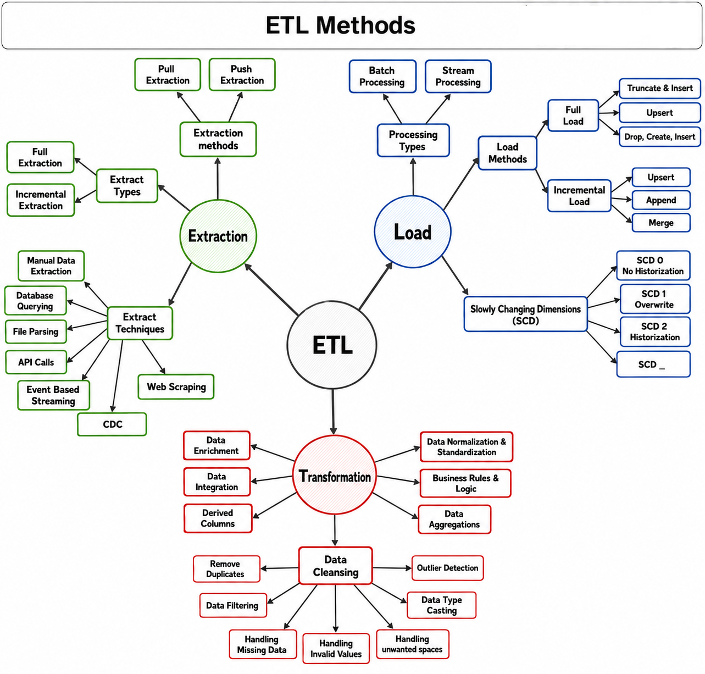

*ETL pipeline: Extract → Transform → Load.*

**In short:**

👉 **Extract = Get the data**

👉 **Transform = Clean & prepare the data**

👉 **Load = Store the data**

### Methods Used in Projects

**Extraction Methods**

- **Full Extraction** – Extracts the entire dataset from the source.
- **File Parsing** – Reads and extracts data from files such as CSV, Excel, or text files.
- **Pull Extraction** – The ETL system pulls data from the source when required.

**Processing Method**

- **Batch Processing** – Data is collected and processed in batches at scheduled intervals.

**Transformation & Data Cleaning**

- Data integration and enrichment
- Normalization and standardization
- Business rules
- Aggregations and derived columns
- Duplicate removal
- Missing/invalid value handling
- Type casting
- Outlier handling
- Unwanted-space handling

**Load Method**

- **Full Load – Truncate & Insert** – Existing target data is truncated and the complete dataset is inserted again.

**SCD Method**

- **SCD Type 1** – Updates existing records by overwriting old values; no history is maintained.

---

## Gold Layer

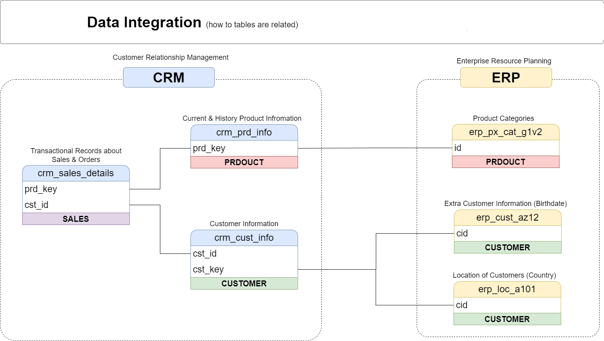

*Gold layer: business objects and analytics model.*

### Star vs Snowflake Schema

- **Star Schema:** Simple and easy to understand and query. However, dimension tables can become large and may contain some duplicate data.
- **Snowflake Schema:** More complex because dimensions are further broken down into multiple tables. This can improve **storage efficiency** and is useful for handling large datasets.

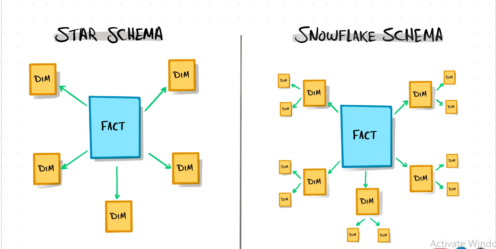

*Star vs snowflake comparison.*

> **IN A STAR SCHEMA, THE RELATIONSHIPS BETWEEN FACT AND DIMENSIONS IS 1-TO-MANY (1:N)**
> 

### Dimensions, Facts & Surrogate Keys in Star Schema

- **Dimension Tables** – Store descriptive information such as customer, product, employee, date, or location details. They provide context for analyzing the data.                            **(WHO? WHAT?  WHERE?)**
- **Fact Tables** – Store measurable business data such as sales, quantity, revenue, or transactions. Fact tables are connected to dimension tables using keys.                              **(HOW MUCH? HOW MANY?)**
- **Surrogate Key** – A unique artificial key generated for each record in a dimension table. It is used to connect the **dimension tables with fact tables** and provides a stable key for data warehousing.

**In this project:**

We used **`ROW_NUMBER()`** to generate the surrogate key column in the dimension tables. This surrogate key is then used in the fact tables to establish relationships with the corresponding dimensions.

### Gold Dimension Tables

- **`gold.dim_customers`** – The **customer_key** is generated using `ROW_NUMBER()` and is used as the surrogate key for customers.
- **`gold.dim_products`** – Similarly, the **product_key** is generated using `ROW_NUMBER()` and is used as the surrogate key for products.
    
    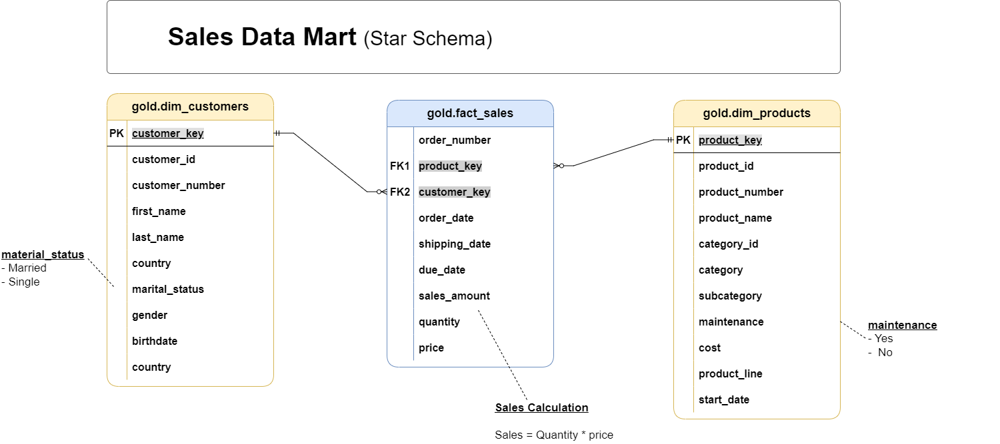
    
    *Star schema data model (dimensions + fact).*
    
    ### Data Modeling
    
    Data modeling is generally divided into **three levels**:
    
    - **Conceptual Data Model:** Provides a high-level overview of the data. It identifies the main **business entities** and their relationships, without going into technical details.
        
        *Example: Customer, Product, and Sales entities and how they are related.*
        
    - **Logical Data Model:** Defines the data structure in more detail, including **entities, attributes, relationships, primary keys, and foreign keys**. It focuses on how the data should be organized without depending on a specific technology.
    - **Physical Data Model:** Represents how the data is **actually implemented** in a database or data platform, including tables, columns, data types, constraints, and storage details. **Databricks** can be used to implement the physical data model.
        
        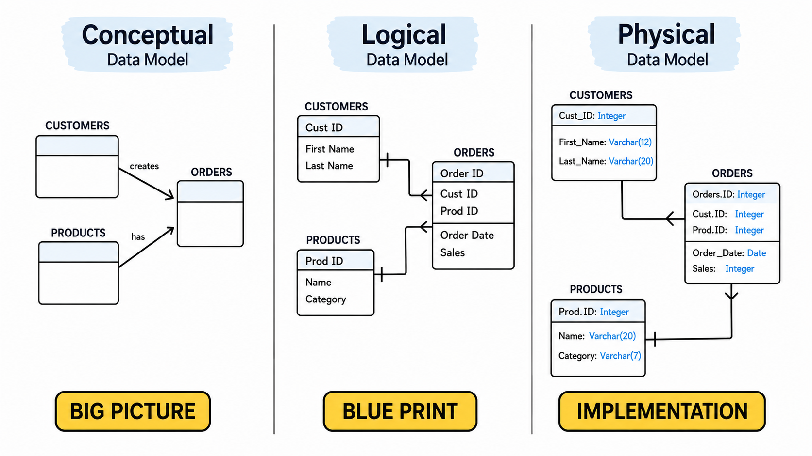
        
        *Physical modeling illustration.*
        
        > Note: This project is implemented in **SQL Server**. (Databricks can be explored as an optional extension for physical implementation in other environments.)
        > 
    
    ### Data Catalog for Gold Layer
    
    The Gold Layer is the business-level data representation, structured to support analytical and reporting use cases. It consists of **dimension tables** and **fact tables** for specific business metrics.
    
    ---
    
    #### 1. **gold.dim_customers**
    
    - **Purpose:** Stores customer details enriched with demographic and geographic data.
    
    | Column Name | Data Type | Description |
    | --- | --- | --- |
    | customer_key | INT | Surrogate key uniquely identifying each customer record in the dimension table. |
    | customer_id | INT | Unique numerical identifier assigned to each customer. |
    | customer_number | NVARCHAR(50) | Alphanumeric identifier representing the customer, used for tracking and referencing. |
    | first_name | NVARCHAR(50) | The customer’s first name, as recorded in the system. |
    | last_name | NVARCHAR(50) | The customer’s last name or family name. |
    | country | NVARCHAR(50) | The country of residence for the customer (e.g., ‘Australia’). |
    | marital_status | NVARCHAR(50) | The marital status of the customer (e.g., ‘Married’, ‘Single’). |
    | gender | NVARCHAR(50) | The gender of the customer (e.g., ‘Male’, ‘Female’, ‘n/a’). |
    | birthdate | DATE | The date of birth of the customer, formatted as YYYY-MM-DD (e.g., 1971-10-06). |
    | create_date | DATE | The date and time when the customer record was created in the system |
    
    ---
    
    #### 2. **gold.dim_products**
    
    - **Purpose:** Provides information about the products and their attributes.
    
    | Column Name | Data Type | Description |
    | --- | --- | --- |
    | product_key | INT | Surrogate key uniquely identifying each product record in the product dimension table. |
    | product_id | INT | A unique identifier assigned to the product for internal tracking and referencing. |
    | product_number | NVARCHAR(50) | A structured alphanumeric code representing the product, often used for categorization or inventory. |
    | product_name | NVARCHAR(50) | Descriptive name of the product, including key details such as type, color, and size. |
    | category_id | NVARCHAR(50) | A unique identifier for the product’s category, linking to its high-level classification. |
    | category | NVARCHAR(50) | The broader classification of the product (e.g., Bikes, Components) to group related items. |
    | subcategory | NVARCHAR(50) | A more detailed classification of the product within the category, such as product type. |
    | maintenance_required | NVARCHAR(50) | Indicates whether the product requires maintenance (e.g., ‘Yes’, ‘No’). |
    | cost | INT | The cost or base price of the product, measured in monetary units. |
    | product_line | NVARCHAR(50) | The specific product line or series to which the product belongs (e.g., Road, Mountain). |
    | start_date | DATE | The date when the product became available for sale or use, stored in |
    
    ---
    
    #### 3. **gold.fact_sales**
    
    - **Purpose:** Stores transactional sales data for analytical purposes.
    
    | Column Name | Data Type | Description |
    | --- | --- | --- |
    | order_number | NVARCHAR(50) | A unique alphanumeric identifier for each sales order (e.g., ‘SO54496’). |
    | product_key | INT | Surrogate key linking the order to the product dimension table. |
    | customer_key | INT | Surrogate key linking the order to the customer dimension table. |
    | order_date | DATE | The date when the order was placed. |
    | shipping_date | DATE | The date when the order was shipped to the customer. |
    | due_date | DATE | The date when the order payment was due. |
    | sales_amount | INT | The total monetary value of the sale for the line item, in whole currency units (e.g., 25). |
    | quantity | INT | The number of units of the product ordered for the line item (e.g., 1). |
    | price | INT | The price per unit of the product for the line item, in whole currency units (e.g., 25). |

---

## Final Project Flow

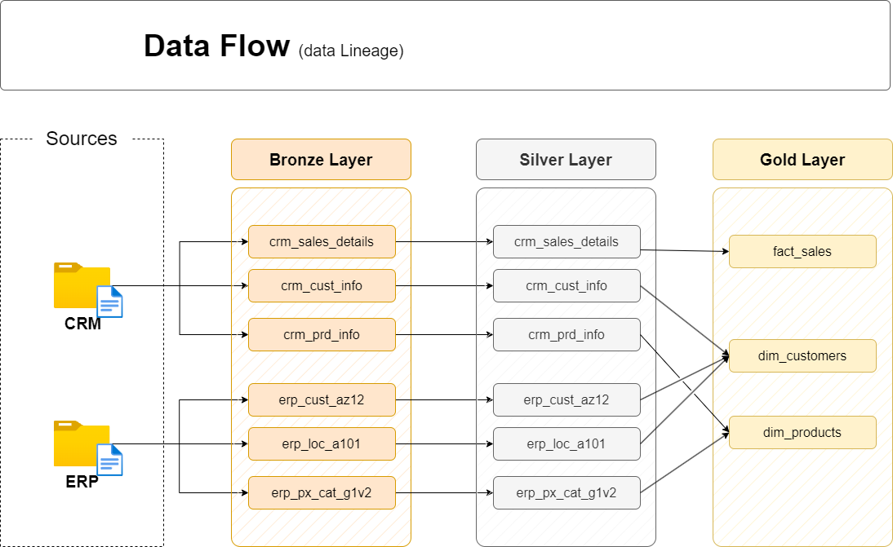

*End-to-end project flow: Bronze → Silver → Gold.*
